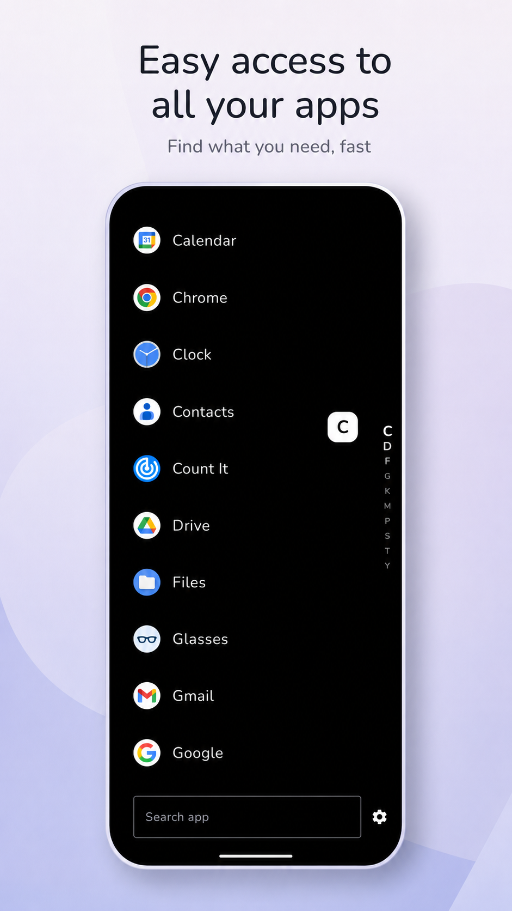
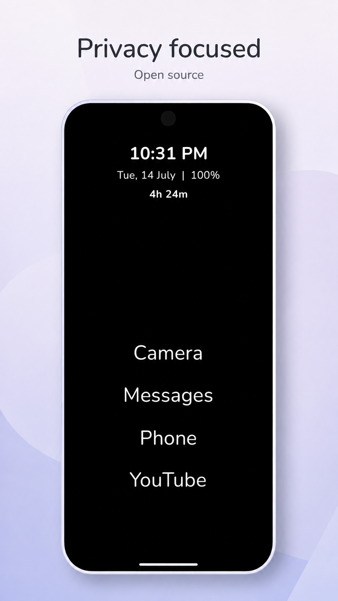
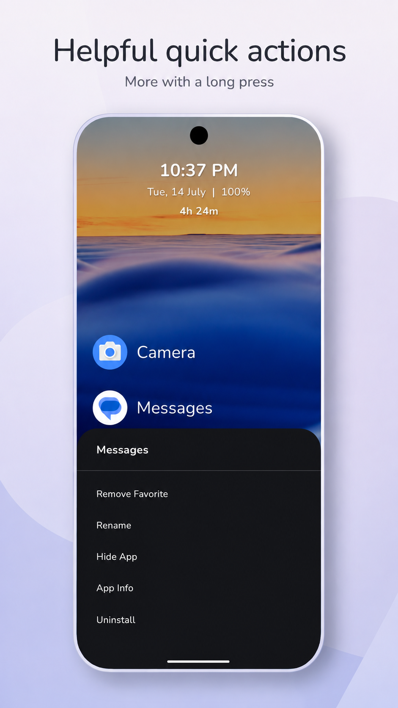
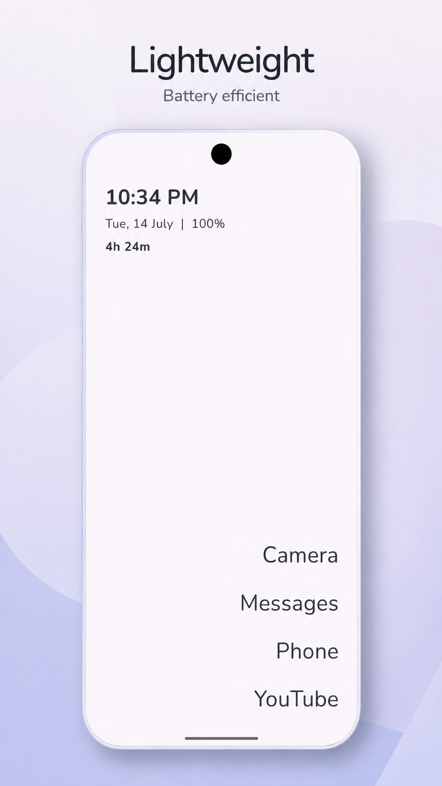
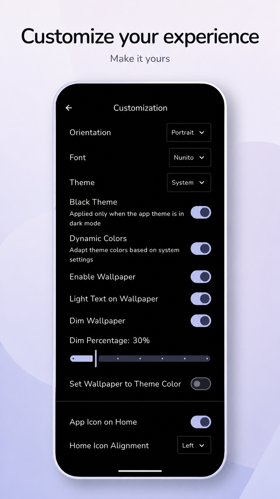

# Minimo

Minimo is a minimalist Android launcher that clears the clutter from your home screen. Find the
apps you need quickly, stay focused, and use your phone more intentionally.

## Screenshots:

  
  
  

  
  
  

## Key Features:

- **Minimalist Home Screen**: Use a text-first layout with optional app icons. Keep a few favourite
  apps visible or leave your home screen empty.
- **Fast App Search**: Find apps in a searchable drawer with A-Z fast scrolling and optional
  automatic opening of the only matching result.
- **Simple App Management**: Reorder favourites, rename or hide apps, and access app info or
  uninstall apps from the launcher.
- **Personalisation**: Adjust fonts, text size, spacing, alignment, themes, wallpaper, and icon
  placement to suit your style.
- **Useful Extras**: Add an optional clock, battery level, notification dots, and daily screen-time
  widget. Use swipe gestures, web shortcuts, and double-tap to lock.
- **Privacy and Open Source**: Minimo does not track you or collect personal information. Its source
  code is available to review and contribute to.

## Download:

## Tech stack & Libraries

- Minimum SDK level 26.
- Target SDK level 37.
- [Kotlin](https://kotlinlang.org/) based,
  utilizing [Coroutines](https://github.com/Kotlin/kotlinx.coroutines) + [Flow](https://kotlin.github.io/kotlinx.coroutines/kotlinx-coroutines-core/kotlinx.coroutines.flow/)
  for asynchronous operations.
- Jetpack Libraries:
  - [Jetpack Compose](https://developer.android.com/compose)
  - [Lifecycle](https://developer.android.com/jetpack/androidx/releases/lifecycle)
  - [ViewModel](https://developer.android.com/topic/libraries/architecture/viewmodel)
  - [Navigation](https://developer.android.com/guide/navigation)
  - [Room](https://developer.android.com/jetpack/androidx/releases/room)
  - [DataStore](https://developer.android.com/jetpack/androidx/releases/datastore)
  - [Hilt](https://dagger.dev/hilt/)
- [Timber](https://github.com/JakeWharton/timber)

## Socials:

- [Join Reddit](https://www.reddit.com/r/MinimoLauncher)
- [Join Discord Channel](https://discord.gg/f4wpPppCDk)
- [X/Twitter](https://x.com/VaibhavLakhera)
- [LinkedIn](https://www.linkedin.com/in/vaibhav-lakhera/)
